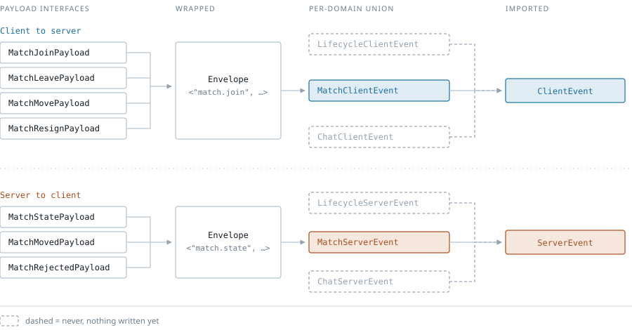

# Transcendence

## WebSocket protocol

Every message either side may send over the socket is declared once in
[`shared/src/ws.ts`](shared/src/ws.ts). The API imports it to know what it is allowed to receive
and emit, the web app imports the same file to know what it is allowed to send and expect. If a
message is not in that file, it is not part of the protocol.

The file is pure types, so it compiles to an empty module and adds nothing to either bundle.

<picture>
  <source media="(prefers-color-scheme: dark)" srcset="docs/ws-protocol-dark.svg">
  
</picture>

### The envelope

Every message has the same frame: `{ type, cid?, payload }`. Reading `type` tells TypeScript
which fields `payload` has. Nesting the payload rather than flattening it costs a `.payload` on
every access, but envelope fields and game fields can never collide, and each section owns a named
payload type instead of everyone editing the same union member.

`cid` is a correlation id. The client stamps it on a request, the server echoes it on a direct
reply so the client can tell which reply belongs to which request. Broadcasts do not carry one,
since a broadcast answers nobody.

### Match events

Seven events are live, all under `match.*`. The server holds the board and clients submit
intentions:

| Event | Direction | Sent to |
| --- | --- | --- |
| `match.join` | client to server | Start receiving updates, as a player or a spectator |
| `match.leave` | client to server | Stop receiving updates. Not a resignation |
| `match.move` | client to server | Offer a move |
| `match.resign` | client to server | Concede |
| `match.state` | server to client | The whole board, in reply to a join or rejoin |
| `match.moved` | server to client | One accepted move, broadcast to everyone watching |
| `match.rejected` | server to client | A refusal, to the sending player alone |

Two details worth knowing before you build against this:

- `move` and `state` are typed `unknown` on purpose. The transport does not know what a move is,
  it hands the value to the engine's `parseMove`, and a throw becomes `match.malformed_move`.
  That is why Reversi will reuse these events unchanged instead of needing a second set.
- `match.state` and `match.moved` both carry a `moveNumber`. Each broadcast is one higher than the
  last. A client that sees a gap knows it missed a move and should rejoin for a fresh board.

Errors are events carrying machine readable codes, never prose the client is expected to display.
`ErrorCode` splits into `TransportErrorCode`, `MatchErrorCode` and `ChatErrorCode`, each namespaced
with the same prefix as its events so the three sets cannot collide as they grow.

### What is still open

The dashed boxes above are `never`, which contributes nothing to a union, so the empty sections
typecheck today and `ClientEvent` and `ServerEvent` widen on their own once they are filled in.
No edit to the top level unions is needed.

- Transport: `TransportErrorCode` plus connect, authenticate, disconnect and reconnect.
- Chat and presence: `ChatErrorCode` plus the `chat.*` events.

Note that types are erased at build time, so nothing stops a malformed frame from arriving over
the wire. Validating incoming messages at the door is part of the transport work.

### Sending a message from the web app

[`apps/web/src/lib/protocol.ts`](apps/web/src/lib/protocol.ts) has one builder per client message,
so no component constructs an envelope by hand:

```ts
import { joinMatch, sendMove } from './lib/protocol'

socket.send(joinMatch(matchId, 'a1'))
socket.send(sendMove(matchId, { x: 7, y: 7 }))
```
