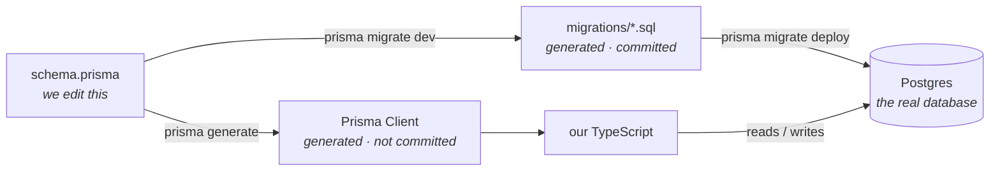
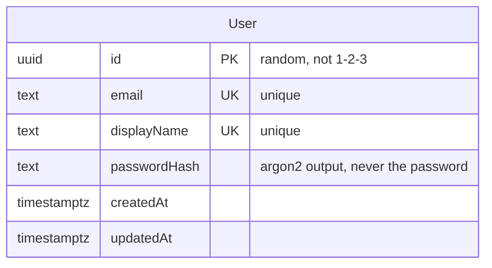
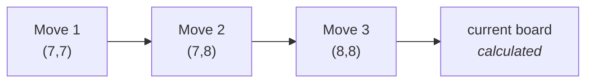

# The database, explained from scratch

No database or Prisma experience needed. This covers what we store, how we
change it safely, and the rules we all follow.

## The problem this solves

Five people share one database. If everyone changed it directly, nobody's
copy would match anyone else's, and the server would meet a database it
didn't expect.

So nobody touches the database by hand. Instead we describe what we want in
one file, and a tool writes the exact SQL to get there. That SQL gets
committed, and everyone replays the same steps to arrive at the same place.

## The three pieces

Prisma is the tool. It has three parts, and it helps a lot to know which is
which:



| Piece | Where | Who writes it |
|---|---|---|
| **The schema** | `apps/api/prisma/schema.prisma` | **You.** The only file you edit. |
| **The migrations** | `apps/api/prisma/migrations/` | Prisma. Committed, because they're the record of how a database gets built. |
| **The client** | `apps/api/src/generated/` | Prisma. **Not** committed — rebuilt on every `npm install`. |

The client is the bit that gives you autocomplete: `prisma.user.findMany()`
exists because `User` is in the schema. It is regenerated from the schema,
which is why forgetting a migration is dangerous — see below.

## What's in the database today

One table. Everything else references it, which is why it went in first.



`UK` means a **unique constraint** — a rule Postgres itself enforces. If two
people try to register with the same email at the same instant, the database
rejects the second one. That's stronger than checking in code, where both
requests can look up "is this email taken?", both get "no", and both insert.

## The four rules every table follows

**1. Ids are random (UUID), not counting numbers.**
`3f2b8c1e-…` instead of `1`, `2`, `3`. Counting numbers tell anyone who reads
a URL how many users we have, and let them walk `/users/1`, `/users/2` to
find everyone.

**2. Names stay exactly as written in the schema.**
`model User` is the table `User`; `displayName` is the column `displayName`.
No renaming annotations, so there's nothing to forget when you add a field.
The one cost: Postgres lowercases unquoted names, so in `psql` you need
quotes — `select * from "User"`.

**3. Every table has `createdAt` and `updatedAt`, with a timezone.**
Without a timezone, a stored time is just a clock reading with no record of
*which* clock. With one, it means the same moment everywhere.

**4. If it can be recalculated, don't store it.**

This is the one worth understanding, because it shapes the game tables.

A game's board is not stored. The **moves** are stored, and the board is
rebuilt by replaying them:



The same reasoning is why `User` has no `wins` column. A win count is
counted from the finished games; a stored number is a second source of truth
that goes wrong the first time a row is deleted or a migration backfills it
badly. If replaying ever turns out to be slow, we add a cache then — as a
deliberate, measured change.

## Adding your own table

```bash
# 1. edit apps/api/prisma/schema.prisma — add your model

# 2. let Prisma write the SQL and apply it
npm run prisma:migrate --workspace api -- --name add_friendship

# 3. commit BOTH the schema and the new migrations/ folder
```

Then the rules that stop us breaking each other's databases:

- **Never edit a migration after pushing it.** Everyone who already ran it
  has a stored fingerprint of the old text. Change it and their database
  refuses to migrate. Fix mistakes with a *new* migration.
- **Never run `prisma db push` on a shared branch.** It changes a database
  without leaving a migration behind, so the schema and the migrations drift
  apart silently.
- **One migration per pull request.** Three usually means the first two were
  wrong.
- **Say so in the PR if you drop or rename a column.** It isn't reversible
  and it runs on everybody's database.

### Why CI checks this

Editing the schema without generating a migration has **no symptom on your
machine**. The client is generated from the *schema*, so your code compiles
and autocompletes perfectly — and then the query fails against a column that
was never created, possibly days later on someone else's machine.

So CI starts a real Postgres, applies every committed migration, and compares
the result against the schema. If they disagree, the build fails and names
the missing column. You can run the same check yourself:

```bash
npm run prisma:check --workspace api
```

## Everyday commands

| Command | What it does |
|---|---|
| `make up` | Start the database |
| `npm run prisma:migrate --workspace api -- --name <name>` | Create and apply a migration |
| `npm run prisma:deploy --workspace api` | Apply migrations that already exist |
| `npm run prisma:generate --workspace api` | Rebuild the client after a schema change |
| `npm run prisma:check --workspace api` | Fail if schema and migrations disagree |
| `make psql` | Open a database prompt |

The API runs `prisma migrate deploy` when it starts, so it can never come up
against a database that's behind the code.

## Using it in code

`PrismaModule` is global, so a service just asks for it:

```ts
constructor(private readonly prisma: PrismaService) {}

const user = await this.prisma.user.findUnique({ where: { email } });
```

Let the database enforce what it can. Don't check "is this email taken?"
before inserting — just insert, and catch the failure:

```ts
try {
  await this.prisma.user.create({ data });
} catch (e) {
  // Prisma error code P2002 = a unique constraint was violated.
  // Which one is in:
  //   e.meta.driverAdapterError.cause.constraint.index
  // e.g. "User_email_key" or "User_displayName_key"
}
```

## If something goes wrong

| What you see | What it means |
|---|---|
| `Did not find any relations` in psql | The database is empty — run `npm run prisma:deploy --workspace api` |
| psql prompt shows `-#` not `=#` | It's waiting for you to finish a statement. Type `\r` |
| `make up` complains about `DATABASE_URL` | The password in `DATABASE_URL` doesn't match `POSTGRES_PASSWORD` in `.env` |
| "Update available 7.10.0 → 8.0.0-rc.12" | Ignore it. That's a release candidate we've pinned away from on purpose; its CLI has no `migrate` command |
| `npm audit` reports 3 highs | Known, from the Prisma CLI (a dev tool). Do **not** run `npm audit fix --force` — it "fixes" them by installing that release candidate |
